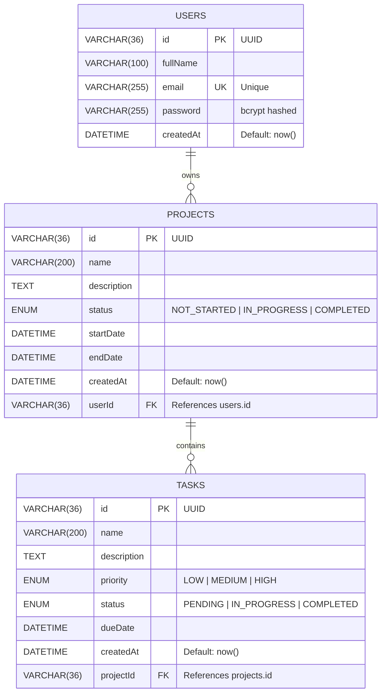

# Database Schema — ER Diagram

## Entity Relationship Diagram

## Table Details

### users
| Column    | Type         | Constraints          |
|-----------|-------------|----------------------|
| id        | VARCHAR(36) | PRIMARY KEY, UUID    |
| fullName  | VARCHAR(100)| NOT NULL             |
| email     | VARCHAR(255)| UNIQUE, NOT NULL     |
| password  | VARCHAR(255)| NOT NULL (bcrypt)    |
| createdAt | DATETIME    | DEFAULT now()        |

### projects
| Column      | Type         | Constraints                         |
|-------------|-------------|-------------------------------------|
| id          | VARCHAR(36) | PRIMARY KEY, UUID                   |
| name        | VARCHAR(200)| NOT NULL                            |
| description | TEXT        | NOT NULL                            |
| status      | ENUM        | NOT_STARTED, IN_PROGRESS, COMPLETED |
| startDate   | DATETIME    | NOT NULL                            |
| endDate     | DATETIME    | NOT NULL                            |
| createdAt   | DATETIME    | DEFAULT now()                       |
| userId      | VARCHAR(36) | FOREIGN KEY → users.id, ON DELETE CASCADE |

### tasks
| Column      | Type         | Constraints                         |
|-------------|-------------|-------------------------------------|
| id          | VARCHAR(36) | PRIMARY KEY, UUID                   |
| name        | VARCHAR(200)| NOT NULL                            |
| description | TEXT        | NOT NULL                            |
| priority    | ENUM        | LOW, MEDIUM, HIGH                   |
| status      | ENUM        | PENDING, IN_PROGRESS, COMPLETED     |
| dueDate     | DATETIME    | NOT NULL                            |
| createdAt   | DATETIME    | DEFAULT now()                       |
| projectId   | VARCHAR(36) | FOREIGN KEY → projects.id, ON DELETE CASCADE |

## Relationships

- **User → Project**: One-to-Many (A user owns many projects)
- **Project → Task**: One-to-Many (A project contains many tasks)

## Cascade Rules

- Deleting a **User** → cascades to delete all their **Projects** → which cascades to delete all associated **Tasks**
- Deleting a **Project** → cascades to delete all its **Tasks**
